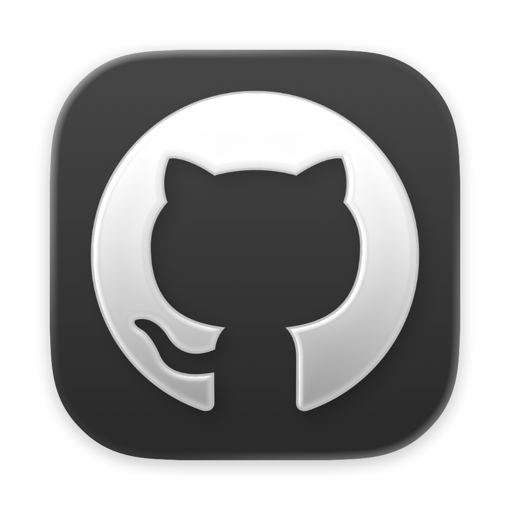

<p align="center">
  
</p>

<h1 align="center">RepoRefresh</h1>

<p align="center">
  <strong>Updater local de repos GitHub baixados em zip.</strong><br>
  Escaneia a pasta, detecta o dono de cada repo, checa o remoto e atualiza com backup — tudo numa página, sem build.
</p>

<p align="center">
  
  
  
  
  
</p>

---

## O que faz

| Passo | Como |
|---|---|
| **SCAN** | Lista pastas extraídas + `.zips` da pasta base |
| **DETECTA** | Descobre `owner/repo` sozinho: convenção `owner__repo`, URL salva, ou metadados dentro do zip (`package.json`, `pyproject.toml`, `Cargo.toml`, `go.mod`, README…) |
| **SUGERE** | Sem dono? Busca candidatos na Search API do GitHub ordenados por ⭐ — um clique mapeia |
| **CHECA** | Compara o commit da branch mapeada × commit remoto (com cache de 10 min) |
| **ATUALIZA** | Baixa o archive pinado no commit verificado, troca a pasta (ou só o `.zip` no modo SÓ-ZIP) com backup `.bak` |
| **REVERTE** | Volta para o backup em um clique |

## Começo rápido

```bash
# 1. Clone e entre
git clone https://github.com/yanhenrique-dev/GithubRepo-sync.git
cd GithubRepo-sync

# 2. Ambiente
python -m venv .venv && source .venv/bin/activate
pip install -r requirements.txt pytest

# 3. Token (opcional, mas recomendado: 60 → 5000 checks/hora)
cp .env.example .env
# edite o .env e ponha um token só-leitura de github.com/settings/tokens

# 4. Rode (terminal)
uvicorn app:app --port 8000
```

Ou com ícone na bandeja (abre o navegador sozinho; fechar o ícone para o servidor):

```bash
./tray.py            # porta 8000
./tray.py 8123       # outra porta
```

Abra **http://127.0.0.1:8000**, cole a pasta dos repos — a detecção é automática.

## Atalhos da interface

- **Filtros** — Todos · Mapeados · Sem dono · Desatualizados · Atualizados · Erros + busca por nome
- **Auto** — com ligado, escanear já emenda no check
- **Modo Pastas / Só-ZIP** — atualiza a pasta extraída ou troca só o `.zip`
- **Badge da API** — na sidebar: `TOKEN OK · 4711/5000`, `SEM TOKEN · 60/H` ou `TOKEN INVÁLIDO`

## API

| Método | Rota | Para quê |
|---|---|---|
| GET | `/api/health` | Verifica se servidor local está pronto |
| GET | `/api/scan?path=` | Lista itens da pasta com mapeamento |
| GET | `/api/check?path=` | Consulta a branch no GitHub e marca `behind` |
| GET | `/api/suggest?q=` | Candidatos `owner/repo` por nome |
| GET | `/api/token` | Status do token + cota (nunca expõe o token) |
| GET | `/api/log` | Últimas linhas do log |
| POST | `/api/map` | Salva `{path, name, url, branch}` |
| POST | `/api/mode` | Alterna `{path, zip_only}` |
| POST | `/api/backup` | Alterna `{path, backup}` |
| POST | `/api/update` | Atualiza `{path, name}` |
| POST | `/api/rollback` | Reverte `{path, name}` para o `.bak` |

## Estrutura

```
├── app.py            # FastAPI + rotas
├── core/
│   ├── scanner.py    # descobre pastas/zips e resolve owner/repo
│   ├── zipmeta.py    # lê dono de dentro do zip (sem rede)
│   ├── github.py     # API do GitHub: check, suggest, cota
│   ├── updater.py    # download, troca, backup, rollback
│   └── state.py      # mapping / state / config por pasta (.alldown/)
├── static/           # front vanilla: index.html, style.css, app.js
├── pyproject.toml    # lint e pytest
└── requirements.txt
```

Por pasta escaneada, o mapeamento fica em `<pasta>/repos.json` e o estado em `<pasta>/.alldown/` (`state.json`, `config.json`) — o `.env` com o token nunca sai da sua máquina. `state.json` guarda SHA da pasta e do ZIP separadamente, evitando status incorreto quando ambos existem.

Ícones [MynaUI](https://mynaui.com/icons) (MIT © Praveen Juge), embutidos como SVG inline.

## Validar alterações

Execute estes comandos antes de abrir pull request:

```bash
.venv/bin/python -m pytest tests/ -q
node --check static/app.js
uvx --from ruff==0.16.8 ruff check app.py core tray.py
uvx --from pyright==1.1.414 pyright --pythonpath .venv/bin/python app.py core tray.py
```

## Operação segura

- Mantenha Uvicorn em `127.0.0.1`; não exponha esta API sem autenticação própria. `ALLDOWN_ALLOW_REMOTE=1` remove bloqueio local, mas exige proxy/autenticação externa confiável.
- Use branch explícita no mapeamento quando quiser fixar uma branch; sem branch, o app consulta a branch padrão do repositório. Mapeamentos criados pela interface registram `branch_explicit`; arquivos legados com `branch: "main"` continuam compatíveis com fallback automático.
- `.alldown`, arquivos de estado, backups e ZIPs têm limites de tamanho e swap transacional para evitar perda de conteúdo.

## Licença

MIT — use, quebre, melhore.
